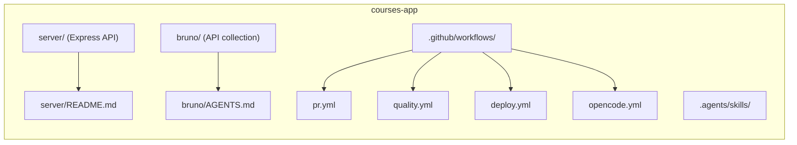

# Courses App

A courses-management project: an **Express + TypeScript REST API** (`server/`) with a **Bruno** API collection (`bruno/`) for manual testing, plus GitHub Actions CI/CD and AI tooling.

## Repo layout

- [`server/`](server/) — the deployable Express 5 + TypeScript REST API (Mongoose, Zod, JWT + argon2, Multer). **Setup, env vars, scripts, and the API reference live in [`server/README.md`](server/README.md).**
- [`bruno/`](bruno/) — Bruno API collection (OpenCollection YAML) for exercising the API. Conventions in [`bruno/AGENTS.md`](bruno/AGENTS.md).
- `.github/workflows/` — GitHub Actions: `pr.yml` (PR checks), `quality.yml` (reusable: lint → typecheck → test → build), `deploy.yml` (merge to `main` → quality + Render deploy), and `opencode.yml` (AI agent you trigger by commenting; maintainers only).
- `.agents/skills/` — AI skills for this project, usable by any AI agent (`bruno-collection-generator`, `node`, `code-review`, `grill-me` + deps).
- [`AGENTS.md`](AGENTS.md) — guidance for AI agents working in this repo (also `server/AGENTS.md` and `bruno/AGENTS.md`).



## Quick start (server)

```bash
cd server
pnpm install
cp .env.example .env   # fill in the values
docker compose up -d   # start local MongoDB
pnpm dev               # http://localhost:3000
```

Full instructions, env vars, tests, build/deploy, and the API reference are in [`server/README.md`](server/README.md).

## CI/CD

- **Pull requests** → `quality.yml`: lint → typecheck → test → build.
- **Merge to `main`** → quality again, then trigger the **Render** deploy hook (`deploy.yml`).
- **OpenCode agent** → post a comment containing `/opencode` or `/oc` on an issue or PR review (maintainers only); it analyzes the repo and replies. See [`AGENTS.md`](AGENTS.md).

## AI agents

Read [`AGENTS.md`](AGENTS.md) for guidance; project skills live in `.agents/skills/`.
