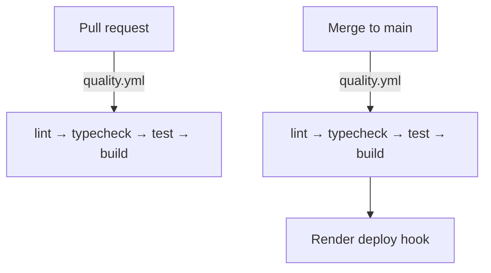

# Courses App

A REST API for managing courses, built with **Express + TypeScript + MongoDB (Mongoose)**, validated with **Zod**, and secured with **JWT + argon2** password hashing.

## Features

- **Authentication** — register, login, refresh, and logout
  - Access token (JWT) returned in the response body, expires in 15 minutes
  - Refresh token stored in an `httpOnly`, `sameSite: lax` cookie, expires in 7 days
  - Passwords hashed with **argon2** (never stored or returned in plaintext)
- **Role-based access control** — `user` and `admin` roles
  - Emails ending in `@emary.dev` are registered as `admin`; all others as `user`
  - `GET /api/course` and `DELETE /api/course/:id` require the `admin` role
- **Course CRUD** — create, read, paginated list, update, delete
- **Avatar uploads** — avatar file upload on registration via **Multer** (jpeg/png/jpg, max 5MB), served statically from `/uploads`
- **Validation** — Zod schemas for request bodies, params, and query strings
- **JSend response format** — consistent `{ status, data }` envelope on every response

## Tech Stack

| Layer      | Technology                           |
| ---------- | ------------------------------------ |
| Runtime    | Node.js (TypeScript, run with `tsx`) |
| Framework  | Express                              |
| Database   | MongoDB (Mongoose ODM)               |
| Validation | Zod                                  |
| Auth       | jsonwebtoken (JWT), argon2           |
| Uploads    | Multer                               |
| Linting    | Biome                                |

## Project Structure

```
server/
├── src/                        # Application source
│   ├── main.ts                 # Bootstrap: build the app, connect DB, listen
│   ├── app.ts                  # Middleware, routing, static uploads
│   ├── types.d.ts              # Global Express.Request type augmentation
│   ├── controllers/            # Request handlers (auth, courses)
│   ├── middleware/             # Auth, role, validation, errors, cookie parsing, upload
│   ├── models/                 # Mongoose schemas (user, course)
│   ├── routes/                 # Express routers
│   ├── schemas/                # Zod validation schemas
│   ├── utils/                  # Constants, JWT helpers, async handler, env loading
│   └── errors/                 # AppError and typed error subclasses
├── tests/                      # Vitest unit + integration tests
├── uploads/                    # Stored avatar files
├── .env.example                # Template for the gitignored `.env`
├── docker-compose.yml          # Local MongoDB container
├── package.json                # Project manifest + scripts
└── biome.jsonc                 # Linting/formatting config
```

> Imports use the `@/` alias (mapped to `src/` via `tsconfig.json` `paths` and
> `vitest.config.ts` `resolve.alias`) with explicit `.ts` extensions, so code
> runs directly with `tsx` and bundles cleanly with `tsup`.

## Getting Started

### Prerequisites

- Node.js (with `pnpm` — the repo pins pnpm via `devEngines.packageManager`)
- **Docker** (recommended) — `docker-compose.yml` runs a local MongoDB for you.
  Any MongoDB instance also works.

### Installation

From the `server/` directory:

```bash
pnpm install
```

### Local MongoDB (Docker)

`server/docker-compose.yml` runs a single `mongo:8.2.11` container on port
`27017` — the quickest way to get the database the API and the tests need. It
is **dev-only**: CI uses its own Mongo service container and Render runs its
own managed database.

From the `server/` directory:

```bash
docker compose up -d      # start MongoDB in the background
docker compose down       # stop it (data is kept in the named volume)
docker compose down -v    # stop it and delete the data volume (fresh start)
```

The container reads `MONGO_INITDB_ROOT_USERNAME` / `MONGO_INITDB_ROOT_PASSWORD`
from `server/.env` and bootstraps its root user from them (the official mongo
image only reads those exact names). To connect to the mongo shell:

```bash
docker exec -it mongodb mongosh -u <user> -p <pass> --authenticationDatabase admin coursesApp
```

### Environment Variables

Copy `.env.example` to `.env` inside `server/` and fill in the values:

| Variable                     | Description                                           |
| ---------------------------- | ----------------------------------------------------- |
| `NODE_ENV`                   | `development` / `production`                          |
| `MONGO_INITDB_ROOT_USERNAME` | Local Mongo root user (docker-compose)                |
| `MONGO_INITDB_ROOT_PASSWORD` | Local Mongo root password (docker-compose)            |
| `MONGODB_URI`                | MongoDB connection string                             |
| `TEST_MONGODB_URI`           | Test DB URI, must end in `_test` (required by Vitest) |
| `JWT_ACCESS_SECRET`          | Secret used to sign access tokens                     |
| `JWT_REFRESH_SECRET`         | Secret used to sign refresh tokens                    |
| `PORT`                       | Application port (default `3000`)                     |

### Run the dev environment

```bash
pnpm install          # once
cp .env.example .env  # once — fill in the values
docker compose up -d  # start local MongoDB
pnpm dev              # start the API (tsx --env-file=.env)
```

The API starts on `http://localhost:3000`.

> **CORS**: public API — any origin is allowed (`origin: true` +
> `credentials: true`), so browser frontends on any domain can call the API
> while still sending the refresh-token cookie.

### Lint & Format (Biome)

```bash
pnpm lint          # check
pnpm lint:fix      # autofix
pnpm format        # format
pnpm format:check  # verify formatting
```

### Tests (Vitest)

Unit and integration tests use [Vitest](https://vitest.dev) and
[Supertest](https://github.com/ladjs/supertest).

```bash
pnpm test             # run all tests once
pnpm test:watch       # watch mode
pnpm test:unit        # unit tests only
pnpm test:integration # integration tests only
pnpm test:coverage    # run with a coverage report
```

Integration tests spin up the real Express app (via `src/app.ts`) and need a
running MongoDB (start one with `docker compose up -d`). They use a dedicated
`coursesApp_test` database — never the development `coursesApp` database. The
URI comes from the `TEST_MONGODB_URI`
environment variable (set in `server/.env`, usually pointing at the local
Docker Mongo instance); `vitest.config.ts` reads it and exposes it to the app
as `MONGODB_URI`.

> Note: the integration suite refuses to run against the development
> `coursesApp` database as a safety guard.

### Build & Run (production)

```bash
pnpm typecheck # run tsc --noEmit to verify types
pnpm build     # bundle TypeScript to dist/ with tsup
pnpm start     # run the built app (node dist/main.js)
```

`pnpm build` produces a single ESM bundle in `dist/`. Dependencies stay
external (loaded from `node_modules`), so `pnpm install --prod` is enough on
the server.

## Conventions

- **Bruno**: every endpoint has a request file in the [`bruno/`](../bruno/) collection (see [`bruno/AGENTS.md`](../bruno/AGENTS.md)).
- **Tests**: every function has a test. Test files live under `tests/` mirroring the source path and use the same base name — e.g. `src/utils/jwt.ts` ↔ `tests/unit/utils/jwt.test.ts`.
- **Utils**: helpers live in `src/utils/` with a filename matching the exported function name (`src/utils/getUserRoleForEmail.ts` exports `getUserRoleForEmail`), and the unit test shares that name.
- **JSDoc**: every function has a JSDoc block with `@param {Type} name - ...` and `@returns {Type} ...` (`@returns {void}` for void handlers).

## CI/CD

GitHub Actions in `.github/workflows/`:

- **`pr.yml`** — runs the shared quality pipeline on every pull request.
- **`quality.yml`** — reusable workflow: lint → typecheck → test → build (spins up a MongoDB service container for the integration tests).
- **`deploy.yml`** — on push/merge to `main`: runs quality, then triggers the Render deploy hook.



Required GitHub repository secrets (Settings → Secrets and variables → Actions):

- `MONGO_INITDB_ROOT_USERNAME`, `MONGO_INITDB_ROOT_PASSWORD` — bootstrap the CI Mongo service container.
- `TEST_MONGODB_URI` — test DB connection string (must end in `_test`).
- `JWT_ACCESS_SECRET`, `JWT_REFRESH_SECRET` — used to sign tokens during tests.
- `RENDER_DEPLOY_HOOK_URL` — Render deploy hook (used by `deploy.yml`).
- `OPENCODE_API_KEY` — OpenCode agent (used by `opencode.yml`).

## API Reference

Base URL: `http://localhost:3000/api`

### Auth — `/auth`

| Method | Endpoint         | Body                                                   | Description                             |
| ------ | ---------------- | ------------------------------------------------------ | --------------------------------------- |
| POST   | `/auth/register` | `name`, `email`, `password`, `avatar` (file, optional) | Create an account (multipart/form-data) |
| POST   | `/auth/login`    | `email`, `password`                                    | Log in, returns `accessToken`           |

### Auth — `/auth` (tokens)

| Method | Endpoint        | Description                                              |
| ------ | --------------- | -------------------------------------------------------- |
| POST   | `/auth/refresh` | Exchange the refresh-token cookie for a new access token |
| POST   | `/auth/logout`  | Clear the refresh-token cookie                           |

### Courses — `/course`

All course endpoints require a Bearer token (`Authorization: Bearer <token>`).

| Method | Endpoint      | Auth   | Role  | Description                          |
| ------ | ------------- | ------ | ----- | ------------------------------------ |
| GET    | `/course`     | Bearer | admin | List courses (`limit`, `page` query) |
| POST   | `/course`     | Bearer | —     | Create a course (`name`, `price`)    |
| GET    | `/course/:id` | Bearer | —     | Get a single course                  |
| PATCH  | `/course/:id` | Bearer | —     | Update a course                      |
| DELETE | `/course/:id` | Bearer | admin | Delete a course                      |

### Validation Rules

**Users**

- `name`: 2–100 chars, letters from any language, spaces, hyphens, apostrophes only
- `email`: valid email, lowercased
- `password`: 6–100 chars (registration)

**Courses**

- `name`: min 3 chars
- `price`: min 500
- `:id`: 24-character hex ObjectId
- Pagination: `limit` 1–20 (default 3), `page` positive integer (default 1)

### Response Format (JSend)

```json
{ "status": "success", "data": { ... } }
```

- `success` → 2xx with `data`
- `fail` → 4xx with `data` (e.g. `{ message }` or field errors)
- `error` → 5xx with `message`

## Authentication Flow

1. **Register** (`POST /auth/register`) or **Login** (`POST /auth/login`) → response body contains `data.accessToken`.
2. Send the access token on protected requests as `Authorization: Bearer <accessToken>`.
3. When the access token expires (15 min), call `POST /auth/refresh` — the server reads the refresh token from the `httpOnly` cookie and returns a new `accessToken`.
4. `POST /auth/logout` clears the refresh-token cookie.

> Note: avatar is only accepted on **register** and uses `multipart/form-data`. Other requests use `application/json`.

## Bruno Collection

An API collection lives in `bruno/` at the repository root (OpenCollection YAML). Open that folder in the **Bruno** desktop app to test the endpoints. The collection:

- Uses `{{BASE_URL}}` / `AUTH_TOKEN` / `COURSE_ID` variables
- Stores the login/register `accessToken` into the `AUTH_TOKEN` collection variable
- Auto-captures a newly created course's `_id` into `COURSE_ID` from `POST /course`
